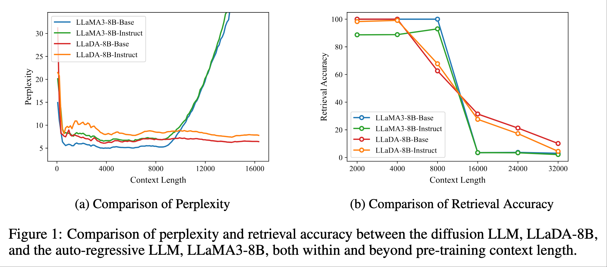
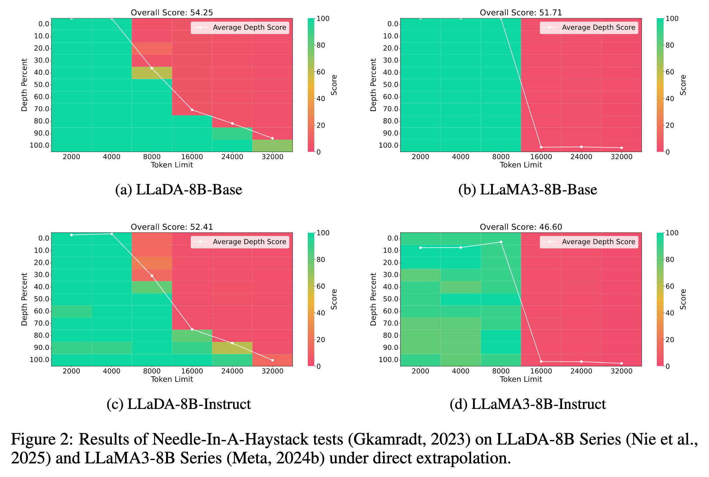
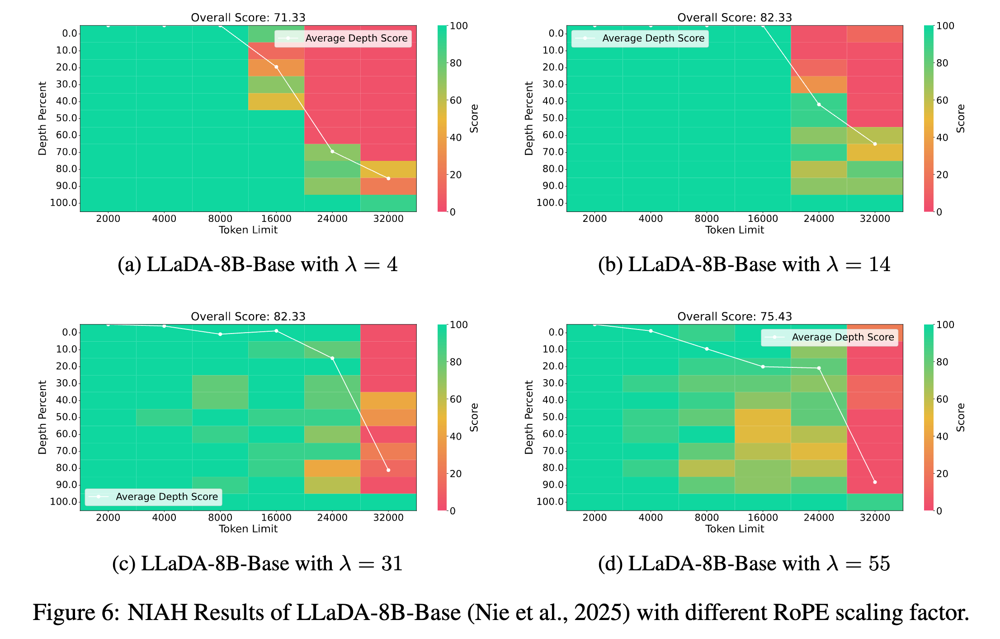
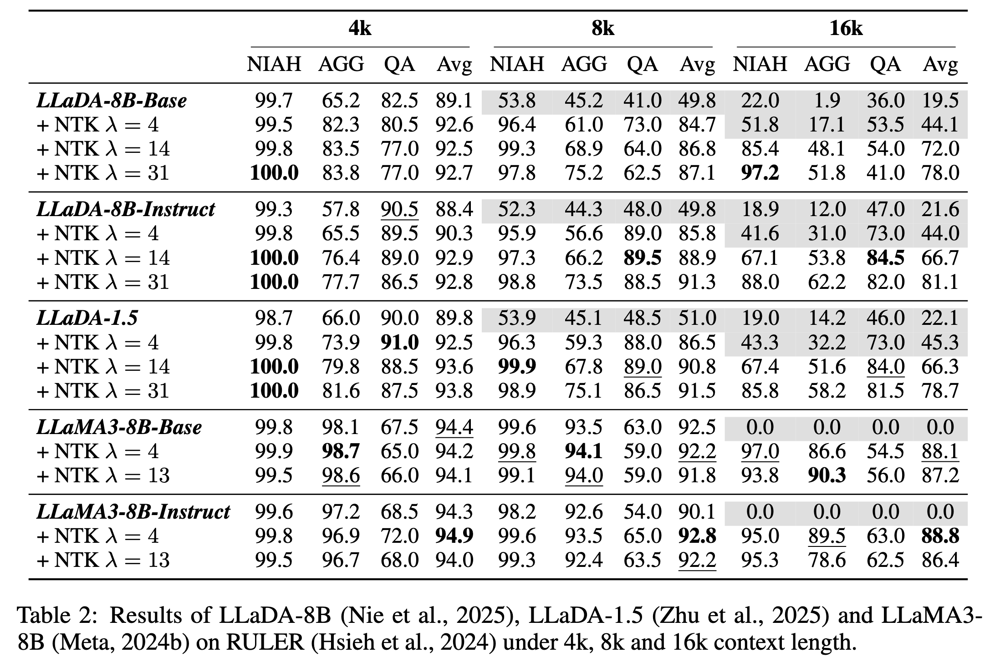

<div align="center">
<h1>LongLLaDA: Unlocking Long Context Capabilities in Diffusion LLMs</h1>
Xiaoran Liu<sup>1,2</sup>, Zhigeng Liu<sup>1</sup>, Zengfeng Huang<sup>1,2</sup>, Qipeng Guo<sup>2,3</sup>, Ziwei He<sup>2,†</sup>, Xipeng Qiu<sup>1,2,†</sup>

<sup>1</sup> Fudan Univerisity, <sup>2</sup>Shanghai Innovation Institute, <sup>3</sup>Shanghai AI Laboratory

[<a href="https://arxiv.org/abs/2506.14429">📝 Paper</a>] | [<a href="https://huggingface.co/papers/2506.14429">🤗 HF</a>] | [<a href="https://github.com/OpenMOSS/LongLLaDA">🚀 Code</a>]
</div>

<!-- --- -->
## Introduction

In this work, we present the first systematic investigation comparing the long-context performance of diffusion LLMs and traditional auto-regressive LLMs. We first identify a unique characteristic of diffusion LLMs, unlike auto-regressive LLMs, they maintain remarkably ***stable perplexity*** during direct context extrapolation. 

Moreover, where auto-regressive models fail outright during the Needle-In-A-Haystack task with context exceeding their pretrained length, we discover diffusion LLMs exhibit a distinct ***local perception*** phenomenon, enabling successful retrieval from recent context segments. We explain both phenomena through the lens of Rotary Position Embedding (RoPE) scaling theory. 

Building on these observations, we propose ***LongLLaDA***, a training-free method that integrates LLaDA with the NTK-based RoPE extrapolation. Our results validate that established extrapolation scaling laws remain effective for extending the context windows of diffusion LLMs. 

Furthermore, we identify long-context tasks where diffusion LLMs outperform auto-regressive LLMs and others where they fall short. Consequently, this study establishes ***the first length extrapolation method for diffusion LLMs*** while providing essential theoretical insights and empirical benchmarks critical for advancing future research on long-context diffusion LLMs. This is the official implementation of LongLLaDA. 

<p align="center">

<p>

## Installation

### Prepare Your OpenCompass

We run our downstream evaluation based on [OpenCompass](https://github.com/open-compass/opencompass).

```bash
git clone https://github.com/open-compass/opencompass
cd opencompass
pip install -e .
```

The necessary Python packages we use and their corresponding versions.

```
flash-attn==2.7.4.post1
torch==2.6.0
transformers==4.46.3
opencompass==0.4.2
```

### Prepare Your Model

Copy the folder `LongLLaDA/llada/` to `opencompass/models/` and add the following line to the end of `opencompass/models/__init__.py`.

```python
from .llada.llada_wrapper import LLaDACausalLM
```

## Evaluation

Copy the folder `LongLLaDA/eval/` to your OpenCompass directory and then you can try the following evaluations.

### Needle-In-A-Haystack (NIAH) evaluation

1. Add a NIAH evaluation script with customizable context length and depth. Copy `LongLLaDA/needlebench/needlebench` to `opencompass/configs/datasets/needlebench` and replace `opencompass/configs/summarizers/needlebench.py` with `LongLLaDA/needlebench/needlebench.py`.

2. Edit the prompt format of the RULER benchmark to enable the base model to respond more effectively by replacing `opencompass/datasets/needlebench/origin.py` with `LongLLaDA/needlebench/origin.py`.

3. You can also modify the plotting code in `opencompass/summarizers/needlebench.py` as shown in `LongLLaDA/needlebench/needlebench_summarizer.py`, which is optional.

4. Execute the following command.

```bash
python run.py eval/eval_llada_niah.py --dump-eval-details -r
```

### LongBench evaluation

1. Execute the following command.

```bash
python run.py eval/eval_llada_long.py --dump-eval-details -r
```

### RULER evaluation

1. Edit the prompt format of the RULER benchmark to enable the base model to respond more effectively. In `ruler_cwe_gen.py`, `ruler_fwe_gen.py`, `ruler_niah_gen.py`, `ruler_qa_gen.py`, `ruler_vt_gen.py` under the path `opencompass/configs/datasets/ruler/`, comment out the '\n' at the end of the prompt. The following is an example in `opencompass/configs/datasets/ruler/ruler_vt_gen.py`.

```python
vt_datasets = [
    {
        'abbr': 'ruler_vt',
        'type': RulerVtDataset,
        'num_chains': 1,
        'num_hops': 4,
        'reader_cfg': dict(input_columns=['prompt'], output_column='answer'),
        'infer_cfg': dict(
            prompt_template=dict(
                type=PromptTemplate,
                template=dict(
                    round=[
                        dict(role='HUMAN', prompt='{prompt}'),
                        # dict(role='BOT', prompt='{answer}\n'),    # comment out this line
                    ]
                ),
            ),
            retriever=dict(type=ZeroRetriever),
            inferencer=dict(type=GenInferencer),
        ),
        'eval_cfg': dict(
            evaluator=dict(type=RulerVtEvaluator),
        ),
    }
]
```

2. Execute the following command.

```bash
python run.py eval/eval_llada_ruler.py --dump-eval-details -r
```

### Perplexity (PPL) Evaluation

> We calculate the perplexity in LongLLaDA directory instead of OpenCompass as follows.

1. Execute the following command to get the perplexity curve of LLaMA3.

```bash
python ppl/get_ppl_llama.py 
```

2. Execute the following command to get the perplexity curve of LLaDA with block_size=64 for efficiency.

```bash
python ppl/get_ppl_llada.py 
```

3. Organize the related results and execute the following command to get Figure 1 in our paper.

```bash
python ppl/get_ppl_plot.py 
```

## Results

<p align="center">

<p>

<p align="center">

<p>

<p align="center">

<p>

## Citation

```
@article{liu2025longllada,
  title={LongLLaDA: Unlocking Long Context Capabilities in Diffusion LLMs},
  author={Liu, Xiaoran and Liu, Zhigeng and Huang, Zengfeng and Guo, Qipeng and He, Ziwei and Qiu, Xipeng},
  journal={arXiv preprint arXiv:2506.14429},
  year={2025}
}
```
